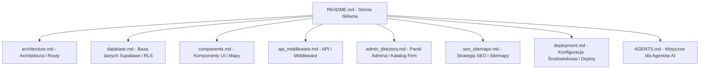

# WypożyczSprzęt Marketplace - Living Documentation Portal

Witamy w portalu dokumentacji projektu **WypożyczSprzęt Marketplace**. Jest to "żyjąca" dokumentacja (living documentation) zawierająca stale aktualizowany opis architektury, bazy danych, mechanizmów SEO, integracji API oraz panelu administracyjnego.

---

## 🗺️ Mapa Dokumentacji

Wybierz interesujący Cię obszar systemu, aby zapoznać się ze szczegółami technicznymi:



### 📄 Przegląd Działów

1. 🏛️ **[Architektura Systemu](file:///e:/sprzety_budowlane/docs/architecture.md)**
   - Struktura katalogów w Next.js 14.
   - Lista stron (Page Routes) i szablonów.
   - Konfiguracja Tailwind CSS i stylów globalnych.

2. 🗄️ **[Baza Danych & Supabase](file:///e:/sprzety_budowlane/docs/database.md)**
   - Opis tabel bazy danych (`companies`, `equipment`, `profiles`, `company_directory`, itp.).
   - Polityki RLS (Row Level Security) dla bezpiecznego dostępu do danych.
   - Indeksy, triggery i relacje między tabelami.
   - Rejestr plików migracyjnych SQL.

3. 🧱 **[Komponenty UI](file:///e:/sprzety_budowlane/docs/components.md)**
   - Kluczowe komponenty: `Marketplace`, `LeafletMap`, `Hero`, `FiltersSidebar`, `CustomSelect`.
   - Biblioteki mapowe (MapLibre, React Map GL) oraz obsługa mediów (Cloudinary).
   - Dynamicznie aktualizowana lista wszystkich komponentów w systemie.

4. 🔒 **[API i Middleware](file:///e:/sprzety_budowlane/docs/api_middleware.md)**
   - Analiza `/middleware.js` oraz `/utils/supabase/middleware.js`.
   - Zabezpieczenie tras panelu klienta (`/dashboard`) i administratora (`/admin`).
   - Integracje z zewnętrznymi API (Geolokalizacja, Google Sheets).

5. 🛠️ **[Katalog Firm i Panel Admina](file:///e:/sprzety_budowlane/docs/admin_directory.md)**
   - Funkcjonalności katalogu firm w `/katalog` i wariantów lokalnych.
   - Server Actions (`/app/admin/actions.js`) wykonujące operacje CRUD.
   - Obsługa zgłoszeń praw do firmy (`claims`) oraz weryfikacji.

6. 🔍 **[Strategia SEO i Sitemapy](file:///e:/sprzety_budowlane/docs/seo_sitemaps.md)**
   - Dynamiczne generowanie metadanych (metatagi, canonical URL).
   - Generowanie dynamicznych map witryny (Sitemap XML).
   - Dane strukturalne JSON-LD (Product, LocalBusiness, Breadcrumbs, FAQ).

7. 🚀 **[Wdrożenie i Zmienne Środowiskowe](file:///e:/sprzety_budowlane/docs/deployment.md)**
   - Plik `.env.local` i wymagane zmienne dla Supabase, Cloudinary, Google Sheets.
   - Proces uruchamiania lokalnego i budowania wersji produkcyjnej (`next build`).

8. 🤖 **[Wytyczne dla Agentów AI](file:///e:/sprzety_budowlane/docs/AGENTS.md)**
   - Instrukcje deweloperskie i zasady projektowe dla asystentów AI.
   - Kluczowe reguły (zmienne CSS, unikanie placeholderów).
   - Analiza pułapek (odświeżanie sesji w Supabase middleware, double-write).

---

## ⚡ Automatyczna Aktualizacja Dokumentacji

Dokumentacja ta posiada zaimplementowany system **Living Documentation**! Za pomocą dedykowanego skryptu narzędziowego, nowo tworzone komponenty, strony oraz pliki migracji SQL są automatycznie skanowane i dodawane do odpowiednich sekcji dokumentacji.

### Jak zaktualizować dokumentację ręcznie?

Uruchom poniższe polecenie w głównym katalogu projektu:
```bash
npm run docs:update
```

Skrypt przeskanuje strukturę projektu i zmodyfikuje sekcje oznaczone specjalnymi komentarzami w plikach:
- `docs/architecture.md` (automatyczna lista tras i stron)
- `docs/components.md` (automatyczna lista zarejestrowanych komponentów React)
- `docs/database.md` (automatyczny spis plików migracyjnych SQL)

---

## ⚙️ Stack Technologiczny

WypożyczSprzęt opiera się na nowoczesnym, zoptymalizowanym stacku technologicznym:

| Technologia | Rola w projekcie |
| :--- | :--- |
| **Next.js 14** | Framework aplikacji React (SSR, dynamiczne routowanie, Server Actions) |
| **Supabase** | Backend-as-a-Service (Baza danych Postgres, Autentykacja, Row Level Security) |
| **React Map GL & Maplibre** | Prezentacja interaktywnych map z geolokalizacją i lokalnymi wypożyczalniami |
| **Tailwind CSS** | System stylizowania UI oparty na klasach narzędziowych |
| **Cloudinary** | Optymalizacja, hosting i przesyłanie zdjęć maszyn oraz logo firm |
| **Google Sheets API** | Synchronizacja i pobieranie masowych danych z arkuszy Google |
