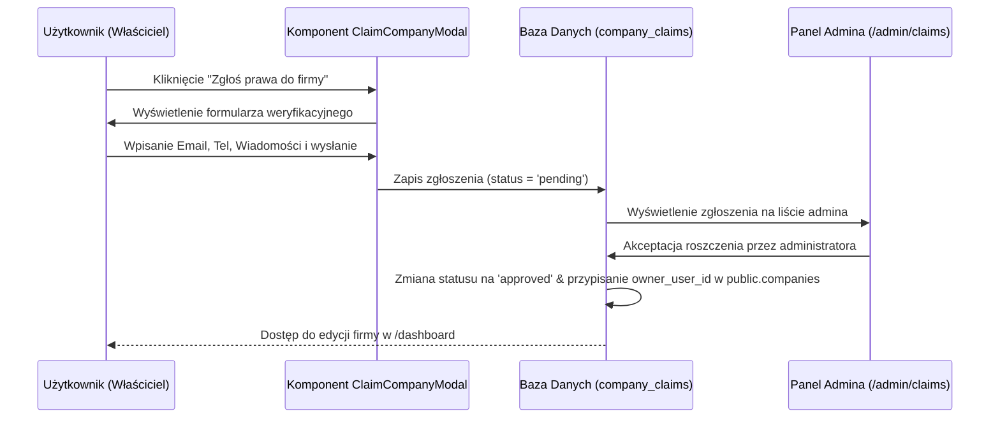

# 🛠️ Katalog Firm i Panel Administracyjny

Aplikacja **WypożyczSprzęt** posiada zintegrowany panel administratora (`/admin`) oraz zaawansowany publiczny katalog firm (`/katalog`) pełniący kluczową rolę w strategii pozycjonowania (SEO). 

---

## 🏛️ Struktura Panelu Administracyjnego (`/admin`)

Do panelu administracyjnego dostęp mają wyłącznie użytkownicy z rolą `admin` przypisaną w bazie danych. Sekcje panelu są podzielone na pięć głównych modułów:

1. **Użytkownicy (`/admin/users`)**: Zarządzanie kontami użytkowników, przydzielanie ról `admin` lub democje do `user`.
2. **Firmy Ryneczku (`/admin/companies`)**: Zarządzanie zgłoszonymi firmami na rynku ogłoszeniowym, edycja ich danych teleadresowych, powiązanie z kontem właściciela.
3. **Sprzęt i Oferty (`/admin/equipment`)**: Moderowanie i zatwierdzanie ofert dodanych przez firmy lub osoby prywatne (zatwierdzanie wgranych zdjęć maszyn, zmiana statusów na `active`, `pending`, `rejected`).
4. **Zgłoszenia Praw (Roszczenia) (`/admin/claims`)**: Weryfikacja wniosków właścicieli o przejęcie kontroli nad automatycznie zaimportowanymi profilami firm z katalogu.
5. **Katalog Wizytówek (`/admin/directory`)**: Panel zarządzania bazą danych katalogu firm (`company_directory` i `company_directory_branches`), ręczne dodawanie nowych wizytówek oraz edycja istniejących placówek.

---

## ⚡ Analiza Akcji Serwerowych (`/app/admin/actions.js`)

Zarządzanie stanem i operacjami zapisu/modyfikacji w panelu admina odbywa się za pomocą bezpiecznych funkcji serwerowych (Next.js **Server Actions**), które automatycznie wymuszają autentykację oraz sprawdzają rolę `admin`.

### 🔒 Kluczowe Mechanizmy Zabezpieczeń
Każda akcja rozpoczyna się od wywołania wewnętrznej funkcji weryfikacyjnej:
- **`checkAdmin()`**: Pobiera aktualną sesję przez `supabase.auth.getUser()`. Jeśli sesja istnieje, sprawdza rekord użytkownika w tabeli `profiles`. Brak uprawnień natychmiast wyrzuca błąd `Unauthorized`.
- **`checkAdminWithServiceRole()`**: Inicjuje klienta Supabase z kluczem **Service Role** (`createSupabaseAdminClient`). Jest to wymagane przy operacjach na bazie danych katalogu, które mogą bypassować polityki RLS w celu bezpośredniego zapisu/migracji.

### 📋 Przegląd Funkcji w `actions.js`
*   `updateUserRole(userId, role)`: Zmienia rolę użytkownika w tabeli `public.profiles`. Automatycznie rewaliduje ścieżkę `/admin/users`.
*   `updateCompanyOwner(companyId, newOwnerId)`: Przypisuje firmę na rynku ogłoszeniowym do innego użytkownika. Powoduje rewalidację tagu cache `listings`.
*   `adminDeleteRecord(table, id)`: Bezpieczne usuwanie wpisów z tabel `companies` i `equipment` na bazie zdefiniowanej listy dozwolonych tabel.
*   `adminUpdateCompany(id, formData)`: Aktualizacja danych firmy z geokodowaniem adresu. Formularz przesyła adres, który jest automatycznie oczyszczany i geokodowany przy użyciu Nominatim, a następnie nowe współrzędne geograficzne są zapisywane w bazie.
*   `adminUpdateEquipment(id, formData)`: Modyfikacja oferty sprzętu z możliwością wgrania nowego zdjęcia. Jeżeli admin przesyła nowy plik graficzny, jest on wysyłany do Cloudinary, a w bazie aktualizowany jest adres URL zdjęcia.
*   `adminCreateDirectoryCompany(formData)`: Server Action dla formularza `DirectoryCompanyForm`. Zapisuje profil główny firmy w katalogu, automatycznie generując unikalny i przyjazny URL (slug) oraz wgrywając logo do folderu `company_logos` na Cloudinary.

---

## 🗺️ Architektura Publicznego Katalogu (`/katalog`)

Katalog firm w `/katalog` stanowi potężne narzędzie SEO, generując tysiące zoptymalizowanych pod kątem wyszukiwarek stron dla lokalnych wypożyczalni maszyn w Polsce.

### 🌐 System Wariantów Lokalnych
Katalog firm dzieli się na dwie główne gałęzie dynamiczne:
1. **Wariant Miejski (`/katalog/[city]/[companySlug]`)**: Profil konkretnej firmy powiązany z wybranym miastem jej oddziału.
2. **Wariant Wojewódzki (`/katalog/woj/[voivodeship]/[companySlug]`)**: Profil firmy powiązany z województwem oddziału.

Strony te wykorzystują funkcję **`generateStaticParams()`** w celu wygenerowania pełnego zestawu statycznych podstron dla wszystkich firm i miast w czasie budowania projektu (Build Time).

### 📍 Dane Strukturalne i Kanoniczność
Aby zapobiec problemom z duplikacją treści (Duplicate Content) przy firmach posiadających wiele oddziałów, system wdraża poniższe mechanizmy:
- **Canonical URL**: Znacznik kanoniczny strony profilowej zawsze wskazuje na główną siedzibę/pierwszy zarejestrowany oddział firmy (`getPrimaryCitySlug(company)`).
- **JSON-LD LocalBusiness**: Każda strona profilowa generuje pełną strukturę danych uporządkowanych dla robotów Google, wstrzykując dane teleadresowe wszystkich oddziałów, oceny gwiazdkowe, opis, numer telefonu oraz witrynę internetową.

---

## 🔑 Proces Przejęcia Wizytówki (Claims & Verification)

Dla profili firm zaimportowanych automatycznie do katalogu wdrożono bezobsługowy proces zgłaszania praw własności przez właścicieli firm:

1. **Inicjacja**: Wchodząc na profil nieprzypisanej firmy w katalogu, użytkownik widzi przycisk *"Zgłoś prawa do firmy"*, który otwiera `ClaimCompanyModal.js`.
2. **Zgłoszenie**: Użytkownik podaje dane kontaktowe oraz dowód własności. Zgłoszenie jest zapisywane w tabeli `public.company_claims` z domyślnym statusem `pending`.
3. **Akceptacja**: Administrator po weryfikacji telefonicznej zatwierdza wniosek w panelu `/admin/claims`.
4. **Rezultat**: System przepisuje prawa własności i przypisuje ID użytkownika do konta firmy w tabeli `companies`. Od tego momentu właściciel uzyskuje pełen dostęp do edycji profilu, oddziałów i cennika maszyn z poziomu swojego panelu `/dashboard`.
