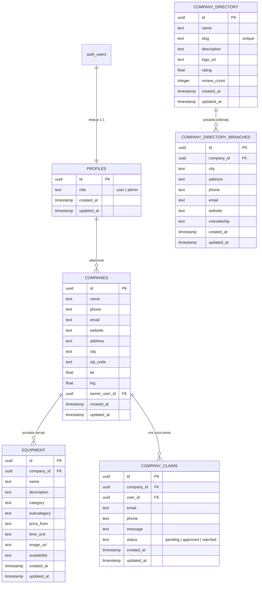

# 🗄️ Baza Danych i Konfiguracja Supabase

WypożyczSprzęt wykorzystuje **Supabase** jako backend bazy danych oparty o **PostgreSQL**. Poniższy dokument opisuje pełną strukturę bazy danych, relacje, triggery, polityki zabezpieczeń RLS (Row Level Security) oraz rejestr migracji.

---

## 📊 Schemat Tabel

Baza danych składa się z dwóch powiązanych ze sobą podsystemów: **głównego panelu ogłoszeniowego** oraz **katalogu firm**.



### 1. `public.profiles`
Tabela powiązana relacją 1:1 z tabelą `auth.users` w Supabase, służąca do zarządzania uprawnieniami użytkowników.
*   `id` (`uuid`, PK): Powiązanie z `auth.users(id)`.
*   `role` (`text`): Uprawnienia użytkownika. Dopuszczalne wartości: `user`, `admin`. Domyślnie `user`.
*   `created_at` / `updated_at`: Znaczniki czasu rejestracji i modyfikacji.

### 2. `public.companies`
Tabela reprezentująca firmy oferujące sprzęt na głównym rynku ogłoszeń.
*   `id` (`uuid`, PK): Unikalny identyfikator firmy.
*   `name` (`text`): Nazwa firmy.
*   `phone` / `email` / `website`: Dane kontaktowe.
*   `address` / `city` / `zip_code`: Lokalizacja biura/siedziby głównej.
*   `lat` / `lng` (`float`): Współrzędne geograficzne na potrzeby wyszukiwania mapowego (geokodowane na serwerze).
*   `owner_user_id` (`uuid`, FK): Powiązanie z `auth.users(id)` (właściciel konta).

### 3. `public.equipment`
Tabela przechowująca oferty wypożyczenia konkretnego sprzętu budowlanego.
*   `id` (`uuid`, PK): Unikalny identyfikator oferty.
*   `company_id` (`uuid`, FK): Powiązanie z `public.companies(id)`.
*   `name` (`text`): Nazwa sprzętu.
*   `description` (`text`): Opis techniczny i warunki najmu.
*   `category` (`text`): Główna kategoria (np. `earthmoving`, `garden`, `power-generators`, `access-platforms`, `tools`).
*   `subcategory` (`text`): Podkategoria (np. `excavators`, `rollers`, `generators`, `scaffolding`).
*   `price_from` (`text`): Stawka początkowa (cena od).
*   `time_unit` (`text`): Jednostka czasu rozliczenia (np. `doba`, `godzina`).
*   `image_url` (`text`): Adres URL zdjęcia zoptymalizowanego w Cloudinary.
*   `availability` (`text`): Status dostępności (np. `dostępny`, `zajęty`).

### 4. `public.company_directory`
Katalog zewnętrzny firm (scrapowany/importowany) mający na celu poprawę SEO i budowanie spisu wypożyczalni w Polsce.
*   `id` (`uuid`, PK): Unikalny identyfikator wpisu.
*   `name` (`text`): Nazwa firmy w katalogu.
*   `slug` (`text`, unique): Unikalny slug wygenerowany na podstawie nazwy na potrzeby przyjaznych adresów URL.
*   `description` (`text`): Opis działalności.
*   `logo_url` (`text`): URL logotypu.
*   `rating` (`float`) / `review_count` (`integer`): Dane ocen i recenzji z zewnętrznych źródeł.

### 5. `public.company_directory_branches`
Oddziały i lokalizacje firm z katalogu. Jedna firma w katalogu może posiadać wiele oddziałów w różnych miastach Polski.
*   `id` (`uuid`, PK): Unikalny identyfikator oddziału.
*   `company_id` (`uuid`, FK): Powiązanie z `public.company_directory(id)`.
*   `city` (`text`): Miasto oddziału.
*   `address` (`text`): Adres fizyczny oddziału.
*   `phone` / `email` / `website`: Dane kontaktowe specyficzne dla oddziału.
*   `voivodeship` (`text`): Województwo (np. `dolnoslaskie`, `mazowieckie`), służące do filtrowania SEO.

### 6. `public.company_claims`
Zgłoszenia roszczeń praw do profili firm z katalogu przez realnych właścicieli.
*   `id` (`uuid`, PK): Identyfikator zgłoszenia.
*   `company_id` (`uuid`, FK): Powiązanie z `public.companies(id)`.
*   `user_id` (`uuid`, FK): Zalogowany użytkownik zgłaszający roszczenie.
*   `email` / `phone`: Kontakt podany przy weryfikacji.
*   `message` (`text`): Uzasadnienie lub przesłane dokumenty uwiarygodniające.
*   `status` (`text`): Status zgłoszenia: `pending` (oczekujące), `approved` (zaakceptowane), `rejected` (odrzucone).

---

## 🔒 Row Level Security (RLS) i Polityki Dostępu

Zabezpieczenia na poziomie wierszy (RLS) gwarantują, że zalogowani użytkownicy mogą modyfikować wyłącznie dane, których są właścicielami. Administratorzy mają pełen dostęp bypassujący ograniczenia.

### 🏛️ Definicja Funkcji Pomocniczej `public.is_admin()`
Służy do szybkiego sprawdzania, czy zalogowana tożsamość posiada rolę administracyjną:
```sql
CREATE OR REPLACE FUNCTION public.is_admin()
RETURNS boolean LANGUAGE sql SECURITY DEFINER SET search_path = public AS $$
  SELECT EXISTS (
    SELECT 1 FROM public.profiles
    WHERE id = auth.uid() AND role = 'admin'
  );
$$;
```

### 📋 Polityki Tabeli `public.companies`
*   **Odczyt (SELECT)**: Wszyscy użytkownicy, w tym niezalogowani (`true`).
*   **Zapis (INSERT)**: Tylko zalogowani użytkownicy pod warunkiem, że przypisują firmę do własnego konta (`auth.uid() = owner_user_id`).
*   **Edycja (UPDATE)**: Tylko właściciel firmy (`auth.uid() = owner_user_id`).
*   **Usuwanie (DELETE)**: Tylko właściciel firmy (`auth.uid() = owner_user_id`).
*   **Administrator (ALL)**: Pełen dostęp bez ograniczeń (`public.is_admin()`).

### 🛠️ Polityki Tabeli `public.equipment`
*   **Odczyt (SELECT)**: Wszyscy użytkownicy (`true`).
*   **Zapis/Edycja/Usuwanie**: Zezwolone tylko wtedy, gdy firma powiązana ze sprzętem należy do zalogowanego użytkownika (`company_id IN (SELECT id FROM companies WHERE owner_user_id = auth.uid())`).
*   **Administrator (ALL)**: Pełen dostęp (`public.is_admin()`).

---

## 🔄 Triggery i Automatyzacja

Baza danych automatycznie dba o spójność danych za pomocą triggerów PL/pgSQL.

### 1. Automatyczne aktualizowanie `updated_at`
Każda zmiana wiersza w tabelach `companies`, `equipment` oraz `company_claims` uruchamia funkcję aktualizującą znacznik modyfikacji:
```sql
CREATE OR REPLACE FUNCTION update_modified_column()
RETURNS TRIGGER AS $$
BEGIN
    NEW.updated_at = now();
    RETURN NEW;
END;
$$ language 'plpgsql';
```

### 2. Automatyczne tworzenie profilu przy rejestracji
W momencie rejestracji nowego użytkownika w Supabase Auth (`auth.users`), trigger automatycznie tworzy dla niego rekord w tabeli `public.profiles` z przypisaną domyślną rolą `user`:
```sql
CREATE OR REPLACE FUNCTION public.handle_new_user()
RETURNS trigger AS $$
BEGIN
  INSERT INTO public.profiles (id, role)
  VALUES (new.id, 'user')
  ON CONFLICT (id) DO NOTHING;
  RETURN new;
END;
$$ LANGUAGE plpgsql SECURITY DEFINER;
```

---

## 📂 Rejestr Plików Migracyjnych SQL

Te skrypty reprezentują historię zmian struktury bazy danych. Są one automatycznie indeksowane przez skrypt narzędziowy `Living Documentation`:

<!-- START_MIGRATIONS_LIST -->
### 📌 Wykryte skrypty SQL (Generowane automatycznie)

*   **[supabase_admin_setup.sql](file:///e:/sprzety_budowlane/supabase_admin_setup.sql)**: Konfiguruje tabelę public.profiles, funkcję pomocniczą is_admin oraz wyzwalacz on_auth_user_created dla automatycznego tworzenia profili.
*   **[supabase_category_migration.sql](file:///e:/sprzety_budowlane/supabase_category_migration.sql)**: Skrypt mapujący polskie kategorie na angielskie identyfikatory i przypisujący szczegółowe podkategorie (np. earthmoving, garden, access-platforms).
*   **[supabase_claims_setup.sql](file:///e:/sprzety_budowlane/supabase_claims_setup.sql)**: Tworzy tabelę claims (roszczeń) do zarządzania prawami do profili firm oraz przydziela uprawnienia RLS dla admina i użytkowników.
*   **[supabase_directory_admin_setup.sql](file:///e:/sprzety_budowlane/supabase_directory_admin_setup.sql)**: Skrócony instalator uprawnień administracyjnych dla tabel katalogu firm.
*   **[supabase_directory_migration.sql](file:///e:/sprzety_budowlane/supabase_directory_migration.sql)**: Dodaje unikalną kolumnę slug do tabeli katalogu, wdraża procedurę automatycznego generowania slugów w bazie i konfiguruje odczyt publiczny.
*   **[supabase_relationship_fixes.sql](file:///e:/sprzety_budowlane/supabase_relationship_fixes.sql)**: Rozwiązuje problemy z kluczami obcymi i indeksami wydajnościowymi między tabelami.
*   **[supabase_restructure_migration.sql](file:///e:/sprzety_budowlane/supabase_restructure_migration.sql)**: ============================================================================
*   **[supabase_security_fixes.sql](file:///e:/sprzety_budowlane/supabase_security_fixes.sql)**: Uaktualnia uprawnienia schematu publicznego i naprawia luki w politykach RLS.
*   **[supabase_setup.sql](file:///e:/sprzety_budowlane/supabase_setup.sql)**: Podstawowy skrypt modyfikujący tabele companies i equipment, włączający RLS oraz polityki edycji dla właścicieli sprzętów.
<!-- END_MIGRATIONS_LIST -->
